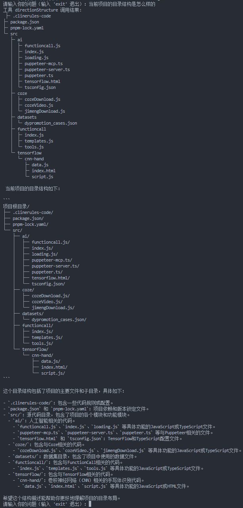
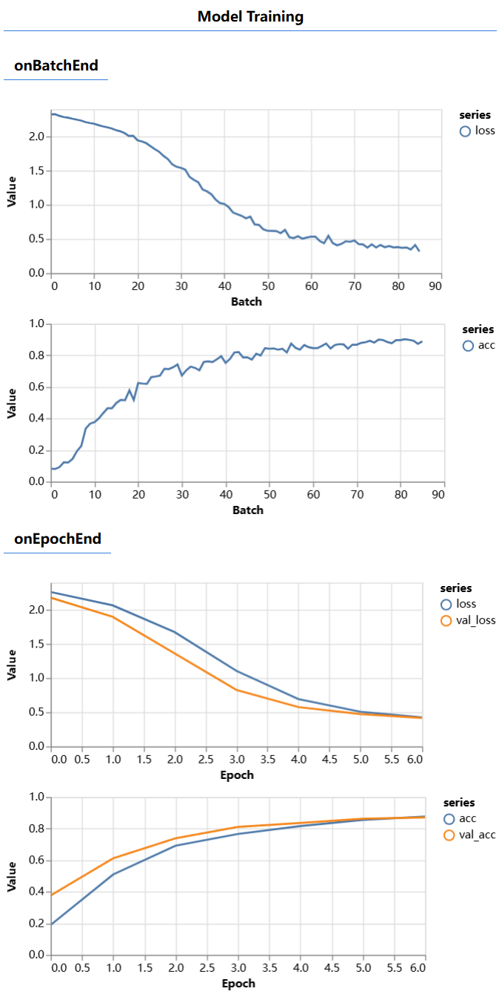
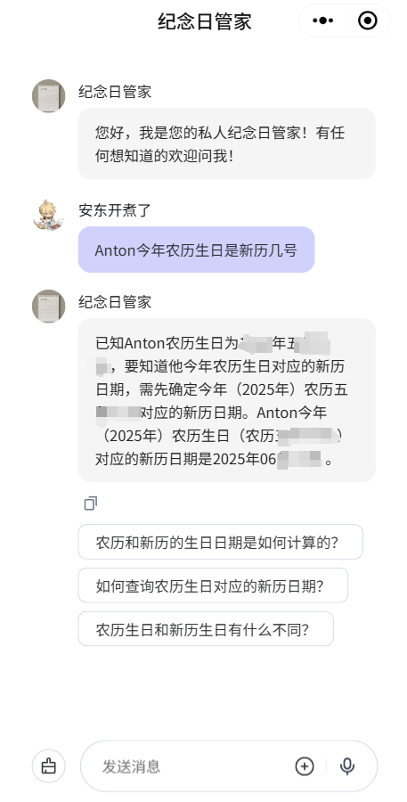

# AI探索

这是一个记录我探索AI过程中实操的项目。在这里，我将分享我在学习和实践AI时编写的各种脚本和项目示例。

## 脚本介绍

### langchain

基于 langchain 实现的AI应用，例如赋予大模型Function Call的能力，串联多个大模型进行复杂功能实现。

#### file-LLM

让大模型具备本地读写的能力，例如通过对话让大模型访问你授权的目录，进行文件编辑。

### MCP

基于 MCP(model-context-protocol) 协议实现的MCP Server

#### puppeteer

使用该服务可以让大模型拥有启动无头浏览器的能力，能实现模拟网页操作、截图、爬虫等工作，可拓展应用到前端UI自动化测试。

### tensorflow

使用tensorflow在线进行模型训练，模型推理

#### cnn-hand

一个手写数字识别的在线训练模块演示

### LLM

大模型接口开发的一些演示

### datasets

数据集，可用以模型微调

#### dypromotion_cases

抖音带货短视频数据集

### coze

coze搭建的AI智能体，AI应用等。

